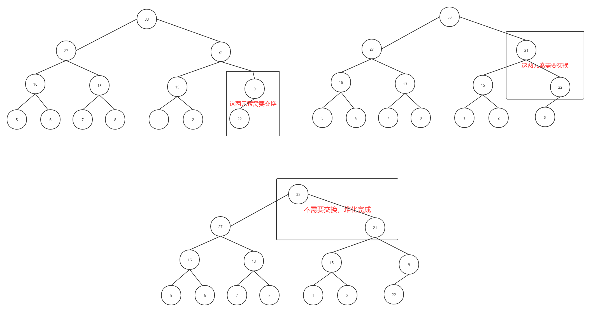
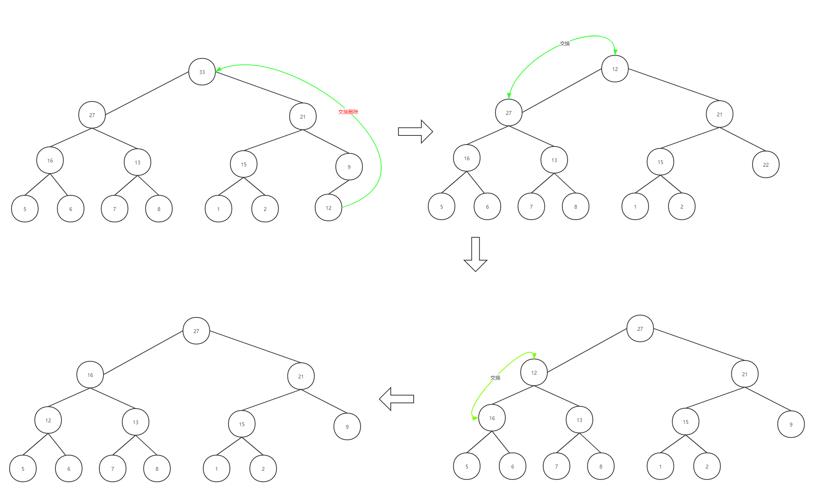

# 学习笔记
***
## 总结

### Hashmap小总结
&ensp;&ensp;&ensp;&ensp;hashmap是基于数组进行实现的，利用数组下标访问数据的特性达到快速访问。其有三个关键概念：键，值，散列函数。其中散列函数是键与值之间的桥梁，数组中存储的是值，散列函数就是把外部输入的键转换成小标，进而访问到对应的值。

&ensp;&ensp;&ensp;&ensp;键经散列函数转换的下标，可能存在相同，这个叫散列冲突，解决冲突有两种方法：

- 开放寻址法：出现冲突，重新探测一个空闲位置，再插入
- 链表法:数组中存储的不是值了，而是一个链表，数据就相应的放入到对应的链表中

#### Java hashmap
&ensp;&ensp;&ensp;&ensp;参考的接口说明和源码如下：

- [Class HashMap<K,V>](https://docs.oracle.com/javase/10/docs/api/java/util/HashMap.html)
- [OpenJDK / jdk8 / jdk8 / jdk](http://hg.openjdk.java.net/jdk8/jdk8/jdk/file/687fd7c7986d/src/share/classes/java/util/HashMap.java)

&ensp;&ensp;&ensp;&ensp;其中的散列函数是这样的：

```java
public final int hashCode() {
    return Objects.hashCode(key) ^ Objects.hashCode(value);
}
```

&ensp;&ensp;&ensp;&ensp;找到一个String的散列函数是,看着好像进行一些简单的运算：

```java
public int hashCode() { 
    int var1 = this.hash; 
    if(var1 == 0 && this.value.length > 0) { 
        char[] var2 = this.value; 
        for(int var3 = 0; var3 < this.value.length; ++var3) { 
            var1 = 31 * var1 + var2[var3]; 
        } 
        this.hash = var1; 
    } 
    return var1;
}
```

&ensp;&ensp;&ensp;&ensp;看下初始化函数，load factor先不管，也不太看的懂。这个初始化函数设置了一个初始的容量大小，还有一个装载因子之类的。

```java
 /**
     * Constructs an empty <tt>HashMap</tt> with the specified initial
     * capacity and load factor.
     *
     * @param  initialCapacity the initial capacity
     * @param  loadFactor      the load factor
     * @throws IllegalArgumentException if the initial capacity is negative
     *         or the load factor is nonpositive
     */
    public HashMap(int initialCapacity, float loadFactor) {
        if (initialCapacity < 0)
            throw new IllegalArgumentException("Illegal initial capacity: " +
                                               initialCapacity);
        if (initialCapacity > MAXIMUM_CAPACITY)
            initialCapacity = MAXIMUM_CAPACITY;
        if (loadFactor <= 0 || Float.isNaN(loadFactor))
            throw new IllegalArgumentException("Illegal load factor: " +
                                               loadFactor);
        this.loadFactor = loadFactor;
        this.threshold = tableSizeFor(initialCapacity);
    }
```

&ensp;&ensp;&ensp;&ensp;看下常用的put，在插入的过程中看到代码里面有树的操作，感觉Java解决冲突使用的链表法：

```java
public V put(K key, V value) {
        return putVal(hash(key), key, value, false, true);
    }

    /**
     * Implements Map.put and related methods
     *
     * @param hash hash for key
     * @param key the key
     * @param value the value to put
     * @param onlyIfAbsent if true, don't change existing value
     * @param evict if false, the table is in creation mode.
     * @return previous value, or null if none
     */
    final V putVal(int hash, K key, V value, boolean onlyIfAbsent,
                   boolean evict) {
        Node<K,V>[] tab; Node<K,V> p; int n, i;
        if ((tab = table) == null || (n = tab.length) == 0)
            n = (tab = resize()).length;
        if ((p = tab[i = (n - 1) & hash]) == null)
            tab[i] = newNode(hash, key, value, null);
        else {
            Node<K,V> e; K k;
            if (p.hash == hash &&
                ((k = p.key) == key || (key != null && key.equals(k))))
                e = p;
            else if (p instanceof TreeNode)
                e = ((TreeNode<K,V>)p).putTreeVal(this, tab, hash, key, value);
            else {
                for (int binCount = 0; ; ++binCount) {
                    if ((e = p.next) == null) {
                        p.next = newNode(hash, key, value, null);
                        if (binCount >= TREEIFY_THRESHOLD - 1) // -1 for 1st
                            treeifyBin(tab, hash);
                        break;
                    }
                    if (e.hash == hash &&
                        ((k = e.key) == key || (key != null && key.equals(k))))
                        break;
                    p = e;
                }
            }
            if (e != null) { // existing mapping for key
                V oldValue = e.value;
                if (!onlyIfAbsent || oldValue == null)
                    e.value = value;
                afterNodeAccess(e);
                return oldValue;
            }
        }
        ++modCount;
        if (++size > threshold)
            resize();
        afterNodeInsertion(evict);
        return null;
    }
```

&ensp;&ensp;&ensp;&ensp;看下常用的get，计算出hash值，取数据：

```java
/**
     * Returns the value to which the specified key is mapped,
     * or {@code null} if this map contains no mapping for the key.
     *
     * <p>More formally, if this map contains a mapping from a key
     * {@code k} to a value {@code v} such that {@code (key==null ? k==null :
     * key.equals(k))}, then this method returns {@code v}; otherwise
     * it returns {@code null}.  (There can be at most one such mapping.)
     *
     * <p>A return value of {@code null} does not <i>necessarily</i>
     * indicate that the map contains no mapping for the key; it's also
     * possible that the map explicitly maps the key to {@code null}.
     * The {@link #containsKey containsKey} operation may be used to
     * distinguish these two cases.
     *
     * @see #put(Object, Object)
     */
    public V get(Object key) {
        Node<K,V> e;
        return (e = getNode(hash(key), key)) == null ? null : e.value;
    }

    /**
     * Implements Map.get and related methods
     *
     * @param hash hash for key
     * @param key the key
     * @return the node, or null if none
     */
    final Node<K,V> getNode(int hash, Object key) {
        Node<K,V>[] tab; Node<K,V> first, e; int n; K k;
        if ((tab = table) != null && (n = tab.length) > 0 &&
            (first = tab[(n - 1) & hash]) != null) {
            if (first.hash == hash && // always check first node
                ((k = first.key) == key || (key != null && key.equals(k))))
                return first;
            if ((e = first.next) != null) {
                if (first instanceof TreeNode)
                    return ((TreeNode<K,V>)first).getTreeNode(hash, key);
                do {
                    if (e.hash == hash &&
                        ((k = e.key) == key || (key != null && key.equals(k))))
                        return e;
                } while ((e = e.next) != null);
            }
        }
        return null;
    }
```

### HeapSort自学记录
*这里就简述下堆的主要概念和使用Python3的大小顶堆的实现*

#### 堆的定义
- 堆是一个完全二叉树：除了最后一层外，其他层几点必须是满的，且最后一层节点从左向右逐步填充
- 堆中每一个父节点的值必须大于等于（或小于等于）其两子树节点的值：大于等于是大顶堆，小于等于是小顶堆

#### 堆的实现
&ensp;&ensp;&ensp;&ensp;完全二叉树使用使用数组来存储，所以堆也是基于数组来实现的，堆最重要的是下面两个基础操作：

- 新增（插入）新元素
- 删除堆顶元素

&ensp;&ensp;&ensp;&ensp;下面详细说明下其操作方法：

##### 新增元素
&ensp;&ensp;&ensp;&ensp;新增元素的算法如下：

- 1.将新增的元素放到堆的最后，也就是数组的最后，但此时可能导致不符合堆的特性了，所以需要第二步的自下向上堆化
- 2.堆化，这里采用自下向上的堆化，即沿着节点的路径，与其父节点进行比较，如果不满足父子节点关系则交换，再继续比较；无法交换则堆化完成

&ensp;&ensp;&ensp;&ensp;下图是一个大顶堆的堆化过程，首先将新元素22插入尾部，然后进行堆化



##### 删除堆顶元素
&ensp;&ensp;&ensp;&ensp;删除堆顶元素的算法如下：

- 1.交换堆顶元素和堆尾元素的值，这样堆就减小，堆顶元素也就删除了，但此时可能导致不符合堆的特性，所有需要第二步的从上向下的堆化
- 2.堆化，这里采用自上向下的堆化，沿着节点的路径，与其子节点进行比较，如果不满足父子节点关系则交换，重复这个过程，知道满足父子节点关系为止

&ensp;&ensp;&ensp;&ensp;下图是一个大顶堆的删除过程过程




##### 大顶堆的实现
&ensp;&ensp;&ensp;&ensp;这里使用Python3简单模拟实现了一个大顶堆，小顶堆类似，也就是比较不同，这里就不重复实现了

```python
class MaxHeap:
    def __init__(self, size: int):
        """
        堆的初始化，设置堆的大小
        :param size: 堆的大小
        """
        # 这里有个小技巧，数组下标不从0开始，而从1开始，这样父子节点的下标获取和计算方便，所有这里数组空间为size+1
        self.data = [None] * (size + 1)
        self.size = size
        self.used = 0
        print("init heap:", self.data)

    def push(self, value: int) -> None:
        """
        堆的插入操作
        :return:
        """
        if self.used == self.size:
            self.pop()

        self.used += 1
        print("insert:", self.used, self.data, end="==>")
        self.data[self.used] = value
        self._shitUp()
        print(self.data)

    def pop(self) -> None:
        """
        堆的删除操作
        :return:
        """
        if self.used == 0:
            return

        self.data[1] = self.data[self.used]
        print("pop:", self.data, end="==>")
        self.used -= 1
        self._shitDown()
        print(self.data)

    def _shitUp(self):
        """
        自下向上的堆化
        与父节点进行比较，大于则交换
        :return:
        """
        child = self.used
        while child // 2 > 0 and self.data[child] > self.data[child//2]:
            self.data[child], self.data[child//2] = self.data[child//2], self.data[child]
            child = child // 2

    def _shitDown(self):
        """
        自上向下的堆化
        这里是与最大值的子节点进行交换，则用了一个maxPos保存最大值的位置
        如果是当前父节点的位置，则堆化结束
        不是则交换父子节点，继续循环
        :return:
        """
        parent = 1
        while True:
            maxPos = parent
            if parent * 2 <= self.used and self.data[parent*2] > self.data[parent]:
                maxPos = parent * 2
            if parent * 2 + 1 <= self.used and self.data[parent*2+1] > self.data[maxPos]:
                maxPos = parent*2+1
            if maxPos == parent:
                break
            self.data[maxPos], self.data[parent] = self.data[parent], self.data[maxPos]
            parent = maxPos

    def toList(self):
        return self.data


if __name__ == "__main__":
    maxHeap = MaxHeap(2)
    maxHeap.push(1)
    maxHeap.push(2)
    maxHeap.push(3)
    print(maxHeap.toList())


init heap: [None, None, None]
insert: 1 [None, 1, None]
insert: 2 [None, 2, 1]
pop: [None, 1, 1]
insert: 2 [None, 3, 1]
[None, 3, 1]
```

#### 作业题347:前 K 个高频元素的使用自写堆
*如何需要去跑测试的话，需要把代码里面的print打印的去掉，不然会超出输出限制。*

&ensp;&ensp;&ensp;&ensp;作业里面有一个是使用堆来解的，答案里面有是使用语言实现，这里就自己实现一个小顶堆来尝试。小顶堆做的唯一修改就是加入一个字典，进行比较时进行转换再比较。大致的代码和思路在下面的代码中。

```python
"""
347. 前 K 个高频元素
给定一个非空的整数数组，返回其中出现频率前 k 高的元素。


示例 1:

输入: nums = [1,1,1,2,2,3], k = 2
输出: [1,2]
示例 2:

输入: nums = [1], k = 1
输出: [1]


提示：

你可以假设给定的 k 总是合理的，且 1 ≤ k ≤ 数组中不相同的元素的个数。
你的算法的时间复杂度必须优于 O(n log n) , n 是数组的大小。
题目数据保证答案唯一，换句话说，数组中前 k 个高频元素的集合是唯一的。
你可以按任意顺序返回答案。


解题思路：
使用小顶堆实现，因为要返回前最大K个数，小顶堆就可以保存着K个数，而堆顶是最小数，剩下的都是大于它的

1.先使用hashmap统计保存数字的出现次数
2.使用k个数据初始化小顶堆
3.比堆顶大的就插入，小于就说明前K大的数没它的份

统计N，遍历N，大顶堆操作logK，则最大时间复杂度O(N)

自己实现个堆来尝试尝试
内置的跑了60ms，自写的56，感觉差不多
"""
import collections
from typing import List
import heapq


class SolutionP:
    def topKFrequent(self, nums, k):
        """
        :type nums: List[int]
        :type k: int
        :rtype: List[int]
        """
        count = collections.Counter(nums)
        return heapq.nlargest(k, count.keys(), key=count.get)


class Solution:
    def topKFrequent(self, nums: List[int], k: int) -> List[int]:
        count = {}
        for num in nums:
            count[num] = count.get(num, 0) + 1
        print(count)

        # 使用K个数初始化堆
        minHeap = MinHeap(k, count)
        keys = list(count.keys())
        print(keys)
        for i in range(0, k):
            minHeap.push(keys[i])

        # 大于堆顶才插入，小于的就说明前K个数没有它的份
        for i in range(k, len(keys)):
            if count[keys[i]] > count[minHeap.getMinest()]:
                minHeap.push(keys[i])
                
        return minHeap.toList()


class MinHeap:
    def __init__(self, size: int, myDict: dict):
        """
        堆的初始化，设置堆的大小
        :param size: 堆的大小
        """
        # 这里有个小技巧，数组下标不从0开始，而从1开始，这样父子节点的下标获取和计算方便，所有这里数组空间为size+1
        self.data = [None] * (size + 1)
        self.size = size
        self.used = 0
        self.myDict = myDict
        print("init heap:", self.data)

    def push(self, value: int) -> None:
        """
        堆的插入操作
        :return:
        """
        print("insert value:", value, end=" ")
        if self.used == self.size:
            self.pop()

        self.used += 1
        print("insert:", self.used, value, self.data, end="==>")
        self.data[self.used] = value
        self._shitUp()
        print(self.data)

    def pop(self) -> None:
        """
        堆的删除操作
        :return:
        """
        if self.used == 0:
            return

        self.data[1] = self.data[self.used]
        print("pop:", self.data, end="==>")
        self.used -= 1
        self._shitDown()
        print(self.data)

    def _shitUp(self):
        """
        自下向上的堆化
        与父节点进行比较，大于则交换
        :return:
        """
        child = self.used
        while child // 2 > 0 and self.myDict[self.data[child]] < self.myDict[self.data[child // 2]]:
            self.data[child], self.data[child // 2] = self.data[child // 2], self.data[child]
            child = child // 2

    def _shitDown(self):
        """
        自上向下的堆化
        这里是与最大值的子节点进行交换，则用了一个maxPos保存最大值的位置
        如果是当前父节点的位置，则堆化结束
        不是则交换父子节点，继续循环
        :return:
        """
        parent = 1
        while True:
            minPos = parent
            if parent * 2 <= self.used and self.myDict[self.data[parent * 2]] < self.myDict[self.data[parent]]:
                minPos = parent * 2
            if parent * 2 + 1 <= self.used and self.myDict[self.data[parent * 2 + 1]] < self.myDict[self.data[minPos]]:
                minPos = parent * 2 + 1
            if minPos == parent:
                break
            self.data[minPos], self.data[parent] = self.data[parent], self.data[minPos]
            parent = minPos

    def getMinest(self) -> int:
        """
        返回堆顶元素值
        :return:
        """
        return self.data[1]

    def toList(self):
        return self.data[1:]


if __name__ == "__main__":
    s = Solution()
    print(s.topKFrequent(nums=[1, 1, 1, 2, 2, 3], k=2))
    # [-3,-4,0,1,4,9]
    print(s.topKFrequent(nums=[6, 0, 1, 4, 9, 7, -3, 1, -4, -8, 4, -7, -3, 3, 2, -3, 9, 5, -4, 0], k=6))
```


## 参考资料
- [HeapSort ：自学 https://www.geeksforgeeks.org/heap-sort/]( https://www.geeksforgeeks.org/heap-sort/)
- [28 | 堆和堆排序：为什么说堆排序没有快速排序快？](https://time.geekbang.org/column/article/69913)